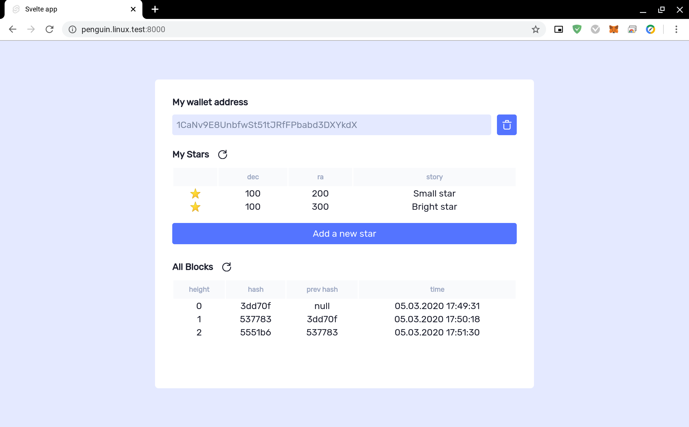
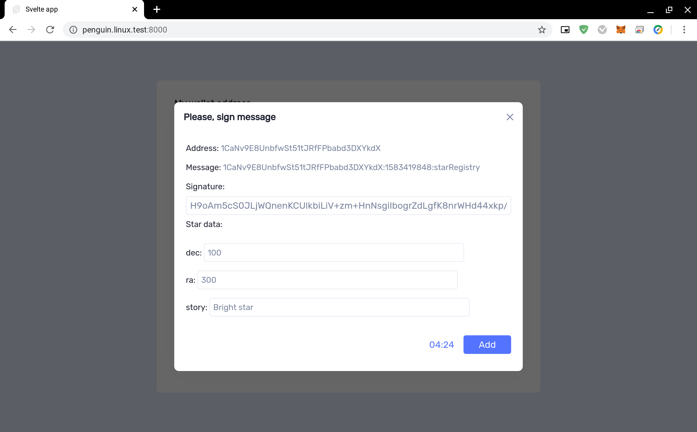

## Udacity *Project 1: Create Your Own Private Blockchain*

### Description:
This app demonstrates how to sign and verify messages using ECDSA (Elliptic Curve Digital Signature Algorithm) used by Bitcoin blockchain. 

### Introduction:

What problem will you solve implementing this private Blockchain application? Your employer is trying to make a proof of concept on how a Blockchain application can be implemented in his company.

He is an astronomy fan and because of that he spends most of his free time searching stars in the sky, that's why he wants to create a test application that allows him and his friends to register stars, and track the ownership of each.

### Technical details:

To use this app you need bitcoin wallet (Electrum or Bitcoin Core for example) for signing messages. To add new star you should sign message from server and send signature. Message is like `<WALLET_ADRESS>:<TIME>:starRegistry`. You need to fill signature, star's details and wait 5 minutes. After you can add star star to blockchain.

### To launch:

* Please use nodejs 10
* `npm i`
* `cd web-app`
* `npm i`
* `npm run build`
* `cd ..`
* `npm run start`
* go to the http://localhost:8000/

### Screenshots:

